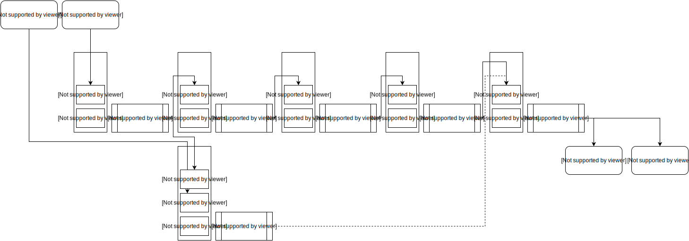

<h1 style='text-align: center; margin-bottom: 1rem'> Open Avatar Chat </h1>

<div align="center">
<strong><a href=./README.md>中文</a>|English</strong>
</div>
<h3 style='text-align: center'>
A modular avatar chat implementation runs on single pc.
</h3>
<div style="display: flex; flex-direction: row; justify-content: center">

<a href="https://github.com/HumanAIGC-Engineering/OpenAvatarChat" target="_blank"></a>
</div>
Demo service using SenseVoice + qwen-plus + CosyVoice, one concurrent session, without VL.
<a href="https://www.modelscope.cn/studios/HumanAIGC-Engineering/open-avatar-chat" target="_blank" style="display: inline-block; vertical-align: middle;">
    
</a>

The following is a demo video:
<br>
<video src="https://github.com/user-attachments/assets/89753aea-370f-4f10-9d05-f4b104f87dd8" controls="controls"></video>

## Requirements
* Need Python 3.10+
* Cuda capable GPU
* 20GB+ VRam needed to load omni-llm model without quantization. 
  * Less than 10GB VRam is sufficient for int4 quantization, but the response quality may be limited.
* Avatar part use CPU to inference, reaches 30fps on an i9-13980HX.
> You can use a cloud-based LLM model API to replace MiniCPM-o, which significantly reduces the configuration requirements. For more details, refer to [ASR + LLM + TTS Method](#asr--llm--tts-as-an-alternative-to-local-minicpm-o).The structure of these two flow is shown in the figure below.
> 


**Note: All path in the config file can be absolute path or path relative to the project root.**
## Performance
Response delay is around 2.2 seconds averaged by 10 measturements on test pc (i9-13900KF and Nvidia RTX 4090).
It's counted between human voice end and subsequent avatar audio starts, which includes bidirectional rtc delay, vad delay and the pipeline computation time.

## Components Dependency

|Type|Project|Github|Model|
|---|---|---|---|
|RTC|HumanAIGC-Engineering/gradio-webrtc|[](https://github.com/HumanAIGC-Engineering/gradio-webrtc)||
|VAD|snakers4/silero-vad|[](https://github.com/snakers4/silero-vad)||
|LLM|OpenBMB/MiniCPM-o|[](https://github.com/OpenBMB/MiniCPM-o)| [🤗](https://huggingface.co/openbmb/MiniCPM-o-2_6)&nbsp;&nbsp;[</img>](https://modelscope.cn/models/OpenBMB/MiniCPM-o-2_6) |
|LLM-int4|||[🤗](https://huggingface.co/openbmb/MiniCPM-o-2_6-int4)&nbsp;&nbsp;[</img>](https://modelscope.cn/models/OpenBMB/MiniCPM-o-2_6-int4)|
|Avatar|HumanAIGC/lite-avatar|[](https://github.com/HumanAIGC/lite-avatar)||
|TTS|FunAudioLLM/CosyVoice|[](https://github.com/FunAudioLLM/CosyVoice)||

## Installation
**Note1：Submodules referred by this project and the models all need git lfs module to be cloned properly, please install it before clone any code.**
```bash
sudo apt install git-lfs
git lfs install 
```
**Note2: third party projects are included by submodule, remember to update submodules.**
```bash
git submodule update --init --recursive
```
#### Download model
Most model and resource files are included in the submodules of this project, except for the LLM model, we currently use MiniCPM-o-2.6 as the omni language model, user can download the model files from Huggingface or Modelscope. Models are recommended to be downloaded into \<ProjectRoot\>/models/, otherwise the default config should be altered. Helper scripts in scripts folder are provided to download corresponding model. Run them under project root.
```bash
scripts/download_MiniCPM-o_2.6.sh
```
```bash
scripts/download_MiniCPM-o_2.6-int4.sh
```
**Note: Both full precision version and the int4 quantized one are supported. However，the int4 version need a special version of AutoGPTQ to load, refer to the [model card](https://huggingface.co/openbmb/MiniCPM-o-2_6-int4) please.**

#### Prepare ssl certificates.
Since we use rtc to stream the video and audio, if not linked from localhost an ssl certificates is needed, user can put exist ones into the ssl_certs folder and config them in the config file or create a new self signed one with the provided script. Run the script under project root to put the result into proper position.
```bash
scripts/create_ssl_certs.sh
```

#### Run the demo
Demo can be start in a linux container or start in host os.
  * Run in container: After prepared GPU capable docker environment, run the following script to build and start the service.
    ```bash
    build_and_run.sh
    ```
  * Run directly:
    * Install requirements
    ```bash
    pip install -r requirements.txt
    ```
    * Start demo
    ```bash
    python src/demo.py
    ```

#### Configs
The default parameter will load config from **<project_root>/configs/sample.yaml**. Config can be loaded from other file by add the --config parameter.
```bash
python src/demo.py --config <absolute-path-to-the-config>.yaml
```
Configurable parameters are listed here：
|Parameter|Default|Description|
|---|---|---|
|log.log_level|INFO|Log level of the demo.|
|service.host|0.0.0.0|Address to start gradio application on.|
|service.port|8282|Port to start gradio application on.|
|service.cert_file|ssl_certs/localhost.crt|Certificate file for ssl, if both cert_file and cert_key are found, https will be enabled.|
|service.cert_key|ssl_certs/localhost.key|Certificate file for ssl, if both cert_file and cert_key are found, https will be enabled.|
|chat_engine.model_root|models|Path to find models.|
|chat_engine.handler_configs|N/A|Handler configs are provided by each handler.|

Current implemented handler provide following configs:
* VAD

|Parameter|Default|Description|
|---|---|---|
|SileraVad.speaking_threshold|0.5|Threshold to determine whether user starts speaking or end speaking.|
|SileraVad.start_delay|2048|Speaking probability should be higher than threshold longer than this period to be recognized as start of speaking, unit in audio sample.|
|SileraVad.end_delay|2048|Speaking probability should be lower than threshold longer than this period to be recognized as end of speaking, unit in audio sample.|
|SileraVad.buffer_look_back|1024|For high threshold, the very start part to the voice may be clipped, use this to compensate, unit in audio sample.|
|SileraVad.speech_padding|512|Silence of this length will be padded on both start and end, unit in audio sample.|

* LLM

|Parameter|Default| Description                                                                                                                                                                                                                                                                                                 |
|---|---|-------------------------------------------------------------------------------------------------------------------------------------------------------------------------------------------------------------------------------------------------------------------------------------------------------------|
|S2S_MiniCPM.model_name|MiniCPM-o-2_6| Which model to load, can be "MiniCPM-o-2_6" or "MiniCPM-o-2_6-int4", it should match the folder's name under model directory.                                                                                                                                                                               |
|S2S_MiniCPM.voice_prompt|| Voice prompt for MiniCPM-o.                                                                                                                                                                                                                                                                                 |
|S2S_MiniCPM.assistant_prompt|| Assistant prompt for MiniCPM-o.                                                                                                                                                                                                                                                                             |
| S2S_MiniCPM.enable_video_input | False         | Whether video input is enabled.**when video input is enbaled vram consumption will be increased largely, on 24GB gpu with non-quantized model, oom may occur during inference.**                                                                                                                            |
| S2S_MiniCPM.skip_video_frame   | -1            | Decide how many frames will be used when video modality is used. -1 means only the latest frame in every 1 second interval will be used. 0 means all frames will be used. n>0 means n frames will be skipped after each accepted frame.|


*ASR FunASR Model*
| Parameter              | Default Value          | Description                                                                 |
|------------------------|------------------------|-----------------------------------------------------------------------------|
| ASR_Funasr.model_name  | iic/SenseVoiceSmall    | This parameter selects a model from [FunASR](https://github.com/modelscope/FunASR). Models are downloaded automatically. To use a local model, provide an absolute path. |

---

*LLM Plain Text Model*

| Parameter                  | Default Value | Description                                                                 |
|----------------------------|---------------|-----------------------------------------------------------------------------|
| LLM_Bailian.model_name     | qwen-plus     | The API for Bailian's testing environment. Free quotas can be obtained from [Bailian](https://bailian.console.aliyun.com/#/home). |
| LLM_Bailian.system_prompt  |               | Default system prompt                                                       |
| LLM_Bailian.api_url        |               | API URL for the model                                                      |
| LLM_Bailian.api_key        |               | API key for the model                                                      |

---

*TTS CosyVoice Model*

| Parameter                      | Default Value | Description                                                                 |
|--------------------------------|---------------|-----------------------------------------------------------------------------|
| TTS_CosyVoice.api_url          |               | Required if deploying CosyVoice server on another machine.                 |
| TTS_CosyVoice.model_name       |               | Refer to [CosyVoice](https://github.com/FunAudioLLM/CosyVoice) for details. |
| TTS_CosyVoice.spk_id           | '中文女' | Use official SFT voices like '英文女' or '英文男'. Mutually exclusive with `ref_audio_path`. |
| TTS_CosyVoice.ref_audio_path  |               | Absolute path to the reference audio. Mutually exclusive with `spk_id`.    |
| TTS_CosyVoice.ref_audio_text  |               | Text content of the reference audio.                                       |
| TTS_CosyVoice.sample_rate      | 24000         | Output audio sample rate                                                   |

---

*Digital Human*

| Parameter                     | Default Value | Description                                                                 |
|-------------------------------|---------------|-----------------------------------------------------------------------------|
| Tts2Face.avatar_name          | sample_data   | Name of the digital human data. Currently, only "sample_data" is available. Stay tuned for more options. |
| Tts2Face.fps                  | 25            | Frame rate for the digital human. On high-performance CPUs, it can be set to 30 FPS. |
| Tts2Face.enable_fast_mode     | True          | Low-latency mode. Enabling this reduces response delay but may cause stuttering at the beginning of responses on underpowered systems. |

##
If you find this project useful, please ⭐️ star the repository. 


**Note: All path parameters in the configuration can use either absolute paths or paths relative to the project root directory.**

---

### ASR + LLM + TTS as an Alternative to Local MiniCPM-o
The local startup requirements for MiniCPM-o are relatively high. If you already have an LLM API key, you can use this method to experience the conversational digital human. After modification, you can still start it using `python src/demo.py`.

> If you encounter any issues, feel free to submit an [issue](https://github.com/HumanAIGC-Engineering/OpenAvatarChat/issues).

* Modify `src/demo.py`

```python
# Uncomment the three processors
from handlers.asr.sensevoice.asr_handler_sensevoice import HandlerASR

engine.register_handler(HandlerASR())
from handlers.llm.openai_compatible.llm_handler_openai_compatible import HandlerLLM

engine.register_handler(HandlerLLM())
from chat_engine.output_handlers.output_handler_tts import HandlerTTS

engine.register_handler(HandlerTTS())

# Comment out MiniCPM processing
# from chat_engine.think_handlers.handler_s2s import HandlerS2SMiniCPM
# engine.register_handler(HandlerS2SMiniCPM())
```

* Modify `config/sample.yaml` for LLM_Bailian Configuration
The internal calling method follows OpenAI's standard format and should theoretically be compatible with similar APIs.
```yaml
LLM_Bailian: 
  model_name: "qwen-plus"
  system_prompt: "You are an AI digital human. Respond to my questions briefly and insert punctuation where appropriate."
  api_url: 'https://dashscope.aliyuncs.com/compatible-mode/v1'
  api_key: 'yourapikey' # default=os.getenv("DASHSCOPE_API_KEY")
```

* Internal Code Calling Method
```python
client = OpenAI(
      api_key= self.api_key, 
      base_url=self.api_url,
  )
completion = client.chat.completions.create(
    model=self.model_name,
    messages=[
        self.system_prompt,
        {'role': 'user', 'content': chat_text}
    ],
    stream=True
)
```

* Defaults:
- ASR defaults to FunASR using `iic/SenseVoiceSmall`.
- LLM defaults to Bailian API URL + API key.
- TTS defaults to CosyVoice's `iic/CosyVoice-300M-SFT` + `Chinese Female`. You can modify it to other models and use `ref_audio_path` and `ref_audio_text` for voice cloning.

## Contributors

[Gang Cheng](https://github.com/lovepope)
[Tao Chen](https://github.com/raidios)
[Feng Wang](https://github.com/sudowind)
[Binchao Huang](https://github.com/bingochaos)
[Hui Xu](https://github.com/xhup)
[Guanqiao He](https://github.com/bboygun)
